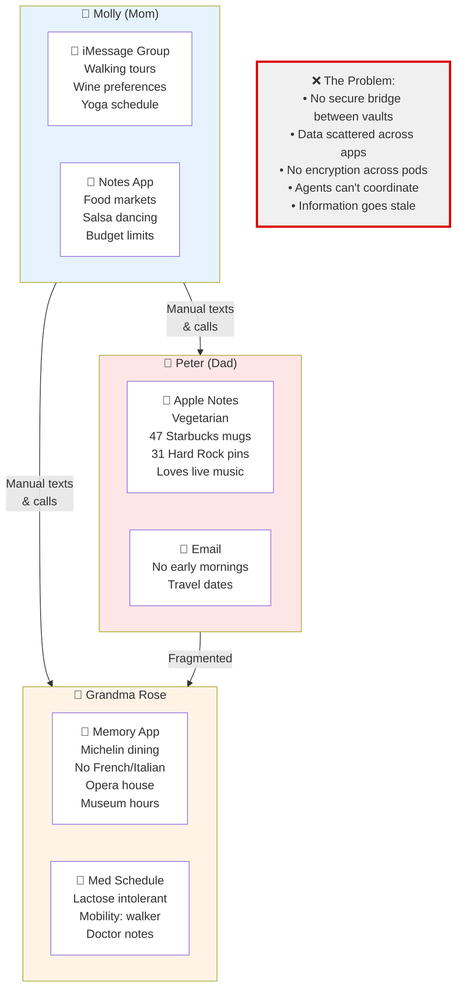
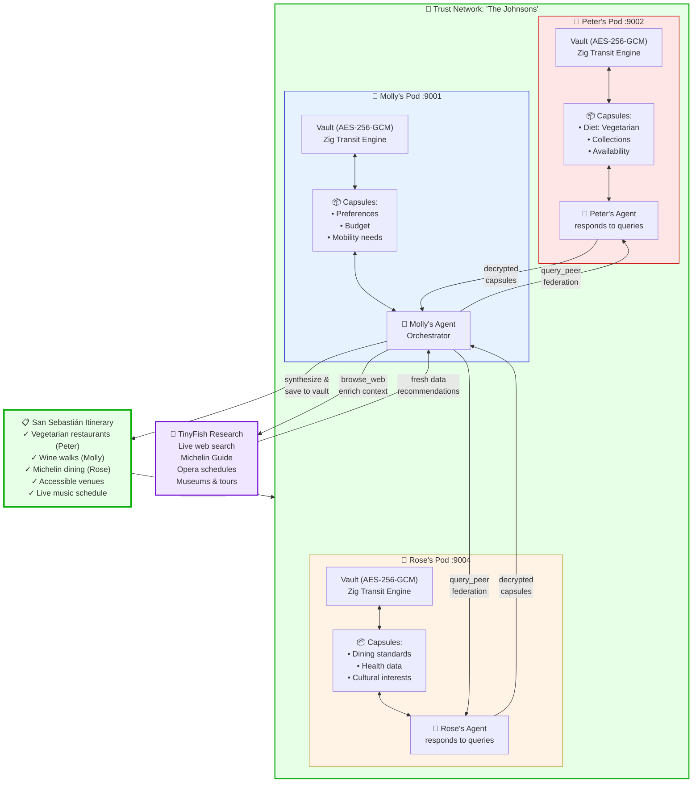
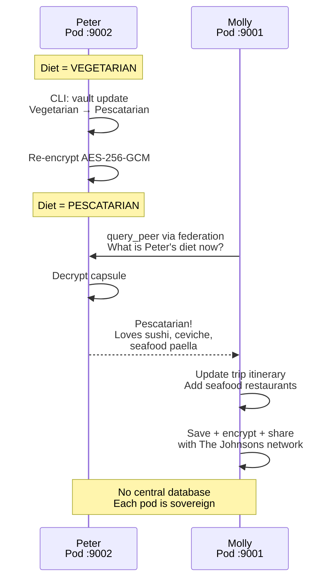

# TinyFish Accelerator — TrustMesh Demo Video Diagrams

## Diagram 1: The Problem — Data Silos

A family of three wants to plan a trip to San Sebastián, Spain. Today, each person's preferences are scattered across different apps with no secure way for their AI agents to coordinate. This diagram shows the pain: manual data collection, no encryption, no trust layer.

---

## Diagram 2: The Solution — TrustMesh + TinyFish Architecture

Each family member has their own encrypted pod. Trust networks connect them. Molly's agent orchestrates: it queries Peter's and Rose's pods via federation, browses the web with TinyFish, synthesizes recommendations, and saves the itinerary back to Molly's vault — all securely.

---

## Diagram 3: Live Update Flow — Peter Changes Diet

Peter updates his diet on his pod. Molly's agent re-queries via federation and sees the change instantly. No central database — each pod is sovereign.

---

## Key Architecture Patterns Illustrated

### Diagram 1 Insights
- **Problem**: Data fragmentation across closed apps creates coordination friction
- **Pain Points**: Manual collection, no encryption, no trust layer, stale information

### Diagram 2 Insights
- **Solution**: Each pod is a sovereign encrypted vault (AES-256-GCM, Zig transit engine)
- **Trust Network**: Family members explicitly grant query access via "The Johnsons" network
- **Federation**: `query_peer` allows cross-pod agent communication with decryption only at source
- **TinyFish Integration**: Live web research enriches AI synthesis with fresh data
- **Synthesis**: Orchestrating agent (Molly) combines all data sources into actionable recommendations
- **Ownership**: Itinerary saved back to Molly's vault, shared via trust network

### Diagram 3 Insights
- **Sovereignty**: Peter's data only decrypts on Peter's pod
- **Live Updates**: No re-entry required — agents query live encrypted state
- **No Central DB**: Each pod manages its own capsules; federation is read-only query
- **Freshness**: Updated itinerary automatically reflects new preferences
- **Trust Boundary**: Federation queries respect the trust network's permissions

---

## Demo Narrative

**Opening**: "Today, family trip planning is fragmented. Everyone's preferences live in separate apps."
- *Show Diagram 1: Data silos*

**The Solution**: "TrustMesh puts each person's data in an encrypted pod. Trust networks connect them."
- *Show Diagram 2: Architecture overview*

**Live Demo**: "Watch what happens when Peter changes his diet..."
- *Show Diagram 3: Sequence of updates flowing through the network*

**Closing**: "No central database. No re-entry. Just secure, real-time coordination across trusted pods."
